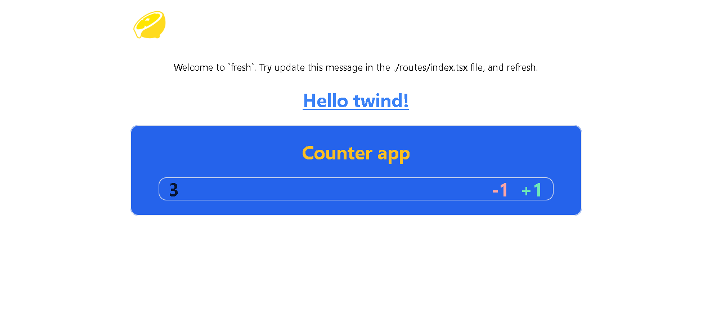

# fresh Web-Freamwork Project



# Deno Install:
https://deno.land/manual/getting_started/installation


# Using PowerShell (Windows):
```
iwr https://deno.land/x/install/install.ps1 -useb | iex
```
# Docker
## For more information and instructions on the official Docker images:   `https://github.com/denoland/deno_docker`

# Updating
## To update a previously installed version of Deno, you can run:
```
deno upgrade
```


### Usage

Start the project:

```
deno task start
```

This will watch the project directory and restart as necessary.


# For Styling

## Twind `https://twind.dev/`
##### The smallest, fastest, most feature complete tailwind-in-js solution in existence

## Twind api v0.16.17 `https://twind.dev/api/README.html` <br/>

## Twind Handbook Guide `https://twind.dev/handbook/introduction.html` <br/>

## Twind github `https://github.com/tw-in-js/twind` <br/>
<br/>
<br/>

## Footer Note
# To more aboute `fresh Web Freamwork`, Surfing on `https://fresh.deno.dev/` 😃


```
                  __       _ 
                 / _|     | |
   __ _ _ __ ___| |_ _   _| |
  / _` | '__/ _ \  _| | | | |
 | (_| | | |  __/ | | |_| | |
  \__,_|_|  \___|_|  \__,_|_|
```